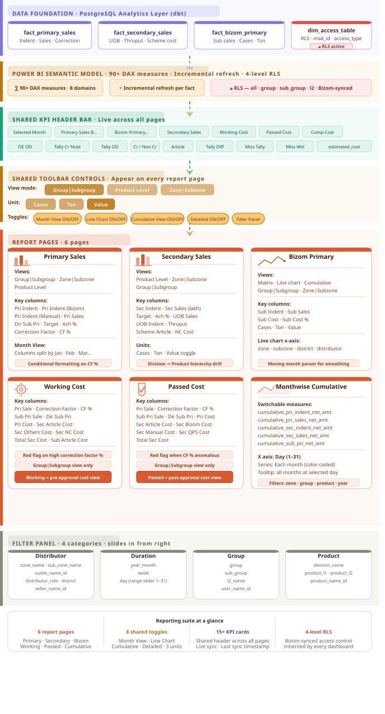

# 📊 Power BI Sales Reporting Suite — FMCG

> A production-grade Power BI reporting suite built for an FMCG company, covering Primary Sales, Secondary Sales, Sub-distributor Sales, Cost Analysis, and Monthwise Cumulative tracking — with dynamic filters, multi-view toggling, RLS-based access control, and live Bizom sync.

> ⚠️ **Note:** All names, distributor identifiers, and numeric values shown in this README are fictional placeholders. The actual dashboard connects to live production data.

---

## 📋 Table of Contents

- [Dashboard Overview](#-dashboard-overview)
- [Report Pages](#-report-pages)
- [Filter System](#-filter-system)
- [View Modes & Toggles](#-view-modes--toggles)
- [KPI Header Bar](#-kpi-header-bar)
- [DAX Measures](#-dax-measures)
- [RLS & Access Control](#-rls--access-control)
- [Data Refresh](#-data-refresh)
- [Tech Stack](#-tech-stack)

---

## 🗺️ Dashboard Overview

```
┌─────────────────────────────────────────────────────────────────────────────┐
│                    FMCG Sales Reporting Suite                               │
│                                                                             │
│  ┌─────────────────┐  ┌─────────────────┐  ┌─────────────────┐             │
│  │  Primary Sales  │  │ Secondary Sales │  │  Bizom Primary  │             │
│  │  Group · Zone   │  │  Product Level  │  │  Sub Sales      │             │
│  │  Zone · Subzone │  │  Zone · Subzone │  │  Line Chart     │             │
│  └─────────────────┘  └─────────────────┘  └─────────────────┘             │
│                                                                             │
│  ┌─────────────────┐  ┌─────────────────┐  ┌─────────────────┐             │
│  │  Working Cost   │  │  Passed Cost    │  │  Monthwise      │             │
│  │  Pri + Sec cost │  │  Correction     │  │  Cumulative     │             │
│  │  breakdown      │  │  Factor view    │  │  Sales chart    │             │
│  └─────────────────┘  └─────────────────┘  └─────────────────┘             │
│                                                                             │
│  Shared across all pages:                                                   │
│  ── KPI header bar  ── Filter panel (4 categories)  ── Month selector      │
│  ── Group|Subgroup / Product Level / Zone|Subzone toggle                   │
│  ── Cases / Ton / Value toggle  ── Detailed mode toggle                    │
└─────────────────────────────────────────────────────────────────────────────┘
```


---

## 📑 Report Pages

### 1. 🟠 Primary Sales — Summary

The core sales report. Shows primary indent vs actual sales across three view modes:

**Group | Subgroup view**

| group | Pri Indent | Pri Indent (Bizom) | Pri Indent (Manual) | Pri Sales | Dir Sub Pri | Target | Ach % | Correction Factor | Correction Factor % |
|---|---|---|---|---|---|---|---|---|---|
| Group A | 2,052.22 | 2,052.22 | — | 1,904.72 | 1,680.86 | — | — | 32.15 | 1.57% |
| Group B | 2,002.97 | 2,002.97 | — | 1,834.85 | 1,644.17 | — | — | 39.11 | 2.12% |
| Group C | 1,614.31 | 1,614.31 | — | 1,497.28 | 1,465.55 | — | — | 18.08 | 1.20% |
| Group D | 1,345.35 | 1,345.35 | — | 1,254.96 | 1,224.33 | — | — | 22.59 | 1.80% |
| Group E | 1,291.14 | 1,291.14 | — | 1,172.48 | 1,181.88 | — | — | -14.15 | -1.21% |
| **Total** | **12,307.97** | **11,077.85** | **1,230.12** | **11,857.19** | **11,315.31** | — | — | **1,035.32** | **8.57%** |

> Correction factor highlights in red when correction % exceeds threshold (e.g. Group D showing 83.61% flags as anomalous)

**Zone | Subzone view**

| zone_name | sub_zone_name | Pri Indent | Pri Indent (Bizom) | Pri Indent (Manual) | Pri Sales | Dir Sub Pri | Target | Ach % |
|---|---|---|---|---|---|---|---|---|
| ZONE ALPHA | Sub Zone 1 | 1,459.72 | 1,459.28 | 0.44 | 1,376.26 | 1,374.72 | — | — |
| | Sub Zone 2 | 879.07 | 879.07 | — | 796.62 | 667.34 | — | 17.46 |
| | Sub Zone 3 | 642.77 | 642.77 | — | 599.53 | 559.25 | — | 14.95 |
| | Sub Zone 4 | 547.27 | 547.27 | — | 499.78 | 462.83 | — | 10.26 |
| | **Total** | **5,109.69** | **4,678.35** | **431.35** | **4,715.61** | **4,391.08** | — | **67.50** |
| ZONE BETA | Sub Zone A | 2,002.97 | 2,002.97 | — | 1,834.85 | 1,644.17 | — | 39.11 |
| | Sub Zone B | 857.82 | 857.82 | — | 791.34 | 753.30 | — | 15.52 |

**Key columns explained:**
- `Pri Indent` — Total primary indent raised (Bizom + Manual)
- `Pri Indent (Bizom)` — Indent placed directly through Bizom app
- `Pri Indent (Manual)` — Manually entered indent (outside Bizom)
- `Pri Sales` — Actual invoiced primary sales value
- `Dir Sub Pri` — Direct sub-distributor primary sales
- `Target` — Monthly sales target
- `Ach %` — Achievement percentage vs target
- `Correction Factor` — Variance adjustment applied to sales figure
- `Correction Factor %` — Correction as % of sales (red-flagged when high)

---

### 2. 🟠 Primary Sales — Month View

Shows monthwise breakup of primary sales by zone when Month View toggle is ON:

| zone_name | sub_zone_name | Jan-2026 | Feb-2026 | Mar-2026 | Apr-2026 | **Total** |
|---|---|---|---|---|---|---|
| ZONE BETA | Sub Zone A | 545.76 | 579.90 | 461.10 | 248.10 | **1,834.85** |
| | Sub Zone B | 243.65 | 236.17 | 223.26 | 88.27 | **791.34** |
| | **Total** | **789.40** | **816.06** | **684.35** | **336.37** | **2,626.19** |
| ZONE GAMMA | Sub Zone X | — | 8.03 | — | 9.63 | **17.66** |
| E-COMMERCE | EC Region 1 | 1.26 | 1.86 | 1.75 | 1.25 | **6.13** |
| | EC Region 2 | 32.14 | 22.64 | 30.90 | 16.46 | **102.14** |
| EXPORTS | Middle East | 83.46 | 69.99 | 63.40 | 24.91 | **241.76** |
| | UK | 16.66 | 18.18 | — | — | **34.85** |

---

### 3. 🟢 Bizom Primary — Sub Sales (Line Chart view)

Multi-line chart showing sub-distributor secondary sales trend over months per zone:

**Chart configuration:**
- X axis: `year_month` (Jan-2025 → Dec-2025)
- Y axis: Sub Sales value (in Lakhs)
- Series: zone_name (color-coded per zone)
- X axis selector: zone_name · sub_zone_name · district · distributor

**Sample tooltip at Day 30 (Dec-2025):**

| Zone | Value |
|---|---|
| Zone Alpha | 663.80 |
| Zone Beta | 395.12 |
| Zone Gamma | 357.06 |
| Zone Delta | 20.48 |
| Zone Epsilon | 10.96 |
| Zone Zeta | 10.19 |

> Moving month parameter (default: 3) smooths the trend line for seasonal adjustment

---

### 4. 🟢 Bizom Primary — Sub Sales (Cases view, Month View)

Matrix showing secondary indent cases by zone per month:

| zone_name | sub_zone_name | Jan-2026 | Feb-2026 | Mar-2026 | Apr-2026 | **Total** |
|---|---|---|---|---|---|---|
| ZONE BETA | Sub Zone B | 7,619.66 | 7,203.10 | 6,500.02 | 3,737.71 | **25,060.49** |
| | **Total** | **23,527.71** | **21,582.52** | **19,359.82** | **10,339.90** | **74,809.96** |
| ZONE GAMMA | Sub Zone X | 400.00 | 329.00 | 502.95 | — | **1,231.95** |
| ZONE GOA | Goa Region | — | 94.00 | 212.29 | — | **306.29** |
| ZONE ALPHA | Sub Zone 1 | 7,435.04 | 5,730.84 | 4,775.45 | 3,357.92 | **21,299.25** |
| | Sub Zone 5 | 5,349.41 | 4,894.40 | 5,390.80 | 3,979.10 | **19,613.72** |

---

### 5. 🔵 Secondary Sales — Product Level (Tons view)

Sales breakdown by division and product category in tons:

| division_name | level_2 | Jan-2026 | Feb-2026 | Mar-2026 | Apr-2026 | **Total** |
|---|---|---|---|---|---|---|
| **Div 1** | Product Cat A | 6.55 | 6.51 | 6.76 | 3.75 | **23.57** |
| | Product Cat B | 0.25 | 0.21 | 0.18 | 0.20 | **0.84** |
| | Product Cat C | 37.72 | 22.13 | 21.07 | 15.71 | **96.63** |
| | Product Cat D | 96.09 | 73.00 | 78.14 | 49.60 | **296.83** |
| | Product Cat E | 65.91 | 53.86 | 58.26 | 30.41 | **208.45** |
| | **Total** | **210.63** | **158.73** | **168.02** | **101.73** | **639.12** |
| **Div 2** | Product Cat F | 175.85 | 129.89 | 88.01 | 70.63 | **464.37** |
| | Product Cat G | 162.44 | 166.21 | 152.12 | 124.05 | **604.82** |
| | Product Cat H | 9.20 | 9.66 | 8.04 | 5.10 | **32.00** |

---

### 6. 🔵 Secondary Sales — Product Level (Detailed view)

Extended view with UOB, scheme costs, and thruput:

| division | level_2 | Sec Indent (lakh) | Sec Sales (lakh) | Target (lakh) | Ach % | UOB Sales | UOB Indent | Thruput | Scheme Article | Scheme NC Cost |
|---|---|---|---|---|---|---|---|---|---|---|
| Div 3 | Cat Pickle | 3,068.29 | 2,231.49 | — | — | 42,456 | 77,382 | 5,256.00 | 111.25 | 0.02 |
| | Cat GGP | 480.36 | 378.96 | — | — | 23,224 | 33,997 | 1,631.74 | 0.01 | 3.34 |
| | Cat Pasta | 76.16 | 62.56 | — | — | 7,196 | 8,658 | 869.38 | — | 0.40 |
| | **Total** | **3,638.51** | **2,677.07** | — | — | **44,417** | **81,508** | **6,027.13** | **0.01** | **114.99** |
| Div 2 | Cat Masala | 1,665.31 | 1,370.91 | — | — | 20,533 | 39,412 | 6,676.63 | 0.05 | 91.54 |
| | Cat CTC | 1,139.63 | 822.37 | — | — | 15,934 | 27,637 | 5,161.12 | 0.20 | 25.83 |

---

### 7. 🟡 Working Cost — Group View

Comprehensive cost breakdown including primary and secondary scheme costs:

| group | Pri Sale | Correction Factor | Correction Factor % | Sub Pri Sale | Dir Sub Pri | Pri Cost | Sec Article Cost | Sec Others Cost | Sec NC Cost | Total Sec Cost |
|---|---|---|---|---|---|---|---|---|---|---|
| Group A | 1,904.72 | 32.15 | 1.57% | 477.74 | 1,680.86 | 137.25 | 0.05 | 76.19 | 81.59 | 76.24 |
| Group B | 1,834.85 | 39.11 | 2.12% | 939.37 | 1,644.17 | 11.92 | — | 47.17 | 0.63 | 47.17 |
| Group C | 1,497.28 | 18.08 | 1.20% | 481.35 | 1,465.55 | 4.34 | 0.01 | 36.53 | 0.02 | 36.54 |
| Group D | 1,254.96 | 22.59 | 1.80% | 550.72 | 1,224.33 | 0.33 | 0.00 | 27.34 | 0.32 | 27.34 |
| Group E | 1,172.48 | -14.15 | -1.21% | 1,151.75 | 1,181.88 | 1.22 | 0.20 | 78.48 | 0.07 | 78.68 |
| **Total** | **11,857.19** | **1,035.32** | **8.57%** | **4,767.51** | **11,315.31** | **224.09** | **0.26** | **294.76** | **90.18** | **295.01** |

---

### 8. 🟡 Passed Cost — Group View

Passed cost view shows the cost structure after correction factor adjustments:

| group | Pri Sale | Correction Factor | Correction Factor % | Sub Pri Sale | Dir Sub Pri | Pri Cost | Sec Article Cost | Sec Bizom Cost | Sec Manual Cost | Sec QPS Cost |
|---|---|---|---|---|---|---|---|---|---|---|
| Group A | 1,904.72 | 32.15 | 1.57% | 477.74 | 1,680.86 | 137.25 | 0.06 | 71.79 | 14.12 | 3.46 |
| Group B | 1,834.85 | 39.11 | 2.12% | 939.37 | 1,644.17 | 11.92 | — | 54.13 | 0.14 | — |
| Group C | 1,579.61 | 26.49 | 1.65% | — | 1,511.21 | 22.62 | — | — | — | — |
| Group D | 1,254.96 | 22.59 | 1.80% | 550.72 | 1,224.33 | 0.33 | 0.47 | 28.52 | 1.34 | 13.32 |
| Group E | 1,047.38 | 886.66 | **83.61%** | 227.45 | 1,063.44 | 13.12 | — | 10.63 | 15.41 | 0.59 |

> Red highlight on Correction Factor % when value exceeds a defined anomaly threshold — signals data quality or pricing issue requiring review

---

### 9. 🟣 Bizom Primary — Sub-Group Sub Sales

Sub-distributor secondary sales and cost summary by group:

| group | Sub Indent | Sub Sales | Sub Cost | Sub Cost% |
|---|---|---|---|---|
| Group A | 535.04 | 550.72 | 18.61 | 3.38% |
| Group B | 519.60 | 1,151.75 | 6.66 | 0.58% |
| Group C | 402.44 | 477.74 | 22.28 | 4.66% |
| Group D | 251.84 | 939.37 | 42.85 | 4.56% |
| Group E | 222.26 | 481.35 | 19.98 | 4.15% |
| Group F | 198.52 | 227.45 | 11.37 | 5.00% |
| Group G | 17.24 | 129.82 | 6.90 | 5.32% |
| Direct | — | 809.30 | 34.69 | 4.29% |
| **Total** | **2,147.62** | **4,767.51** | **163.35** | **3.43%** |

---

### 10. 📈 Monthwise Cumulative Sales

Cumulative sales chart tracking daily build-up across months within the selected year.

**Configuration:**
- X axis: Day (1–31)
- Y axis: Cumulative value (in Lakhs)
- Series: Each month of the selected year (color-coded)
- Filters: zone_name · sub_zone_name · group · sub_group · distributor_role_name · product_category · year_month

**Measures switchable in left panel:**

| Measure | Description |
|---|---|
| `cumulative_pri_indent_net_amount` | Running total of primary indent net value day-by-day |
| `cumulative_pri_sales_net_amount` | Running total of primary sales net value |
| `cumulative_sec_indent_net_amount` | Running total of secondary indent net value |
| `cumulative_sec_sales_net_amount` | Running total of secondary sales net value |
| `cumulative_sub_pri_net_amount` | Running total of sub-distributor primary net value |

**Sample tooltip at Day 30:**

| Month | Value (Lakhs) |
|---|---|
| Jan-2025 | 1,384.56 |
| Mar-2025 | 1,217.93 |
| Apr-2025 | 1,310.62 |
| May-2025 | 1,169.97 |
| Oct-2025 | 1,589.67 |
| Nov-2025 | 1,466.80 |
| Dec-2025 | 1,471.62 |

---

## 🎛️ Filter System

The filter panel has **4 categories** accessible via toggle buttons:

### Distributor filter
| Filter | Options |
|---|---|
| `zone_name, sub_zone_name` | All / specific zone & subzone |
| `outlet_name_id` | All / specific outlet |
| `distributor_role_name, district, distributor...` | All / role / district / distributor |
| `seller_name_id` | All / specific seller |

### Duration filter
| Filter | Options |
|---|---|
| `year_month` | Year selector (e.g. 2026) |
| `week` | All / week number |
| `day` | Range slider (1–31) |

### Group filter
| Filter | Options |
|---|---|
| `group` | All / specific group |
| `sub_group` | All / specific sub-group |
| `l2_name` | All / specific L2 name |
| `user_name_id` | All / specific user |

### Product filter
| Filter | Options |
|---|---|
| `division_name` | All / division |
| `product_l1` | All / L1 product category |
| `product_l2` | All / L2 product category |
| `product_name_id` | All / specific product |

---

## 🔀 View Modes & Toggles

| Toggle | Location | Options | Effect |
|---|---|---|---|
| **Month View** | Top right | ON / OFF | Switches matrix columns from summary to month-by-month breakdown |
| **Line Chart** | Top right | ON / OFF | Switches table view to line chart trend view |
| **Cumulative View** | Top right | ON / OFF | Switches line chart to cumulative running total view |
| **Detailed** | Toolbar | ON / OFF | Adds extended columns (Target, Ach %, Correction Factor, cost columns) |
| **Group\|Subgroup** | Toolbar | Button | Shows data grouped by sales group and sub-group |
| **Product Level** | Toolbar | Button | Shows data broken down by division and product category |
| **Zone\|Subzone** | Toolbar | Button | Shows data by zone and sub-zone geography |
| **Cases** | Toolbar | Button | Shows volume in case units |
| **Ton** | Toolbar | Button | Shows volume in metric tons |
| **Value** | Toolbar | Button | Shows value in Lakhs (₹) |
| **Measure selector** | Left panel (Cumulative page) | List | Switches which cumulative measure is plotted |
| **X axis selector** | Left panel (Line chart) | Radio | Changes the X axis grouping (zone / subzone / district / distributor) |

---

## 📊 KPI Header Bar

Shared across all report pages — shows the selected month's key numbers at a glance:

| KPI Card | Description |
|---|---|
| Selected Month | Currently selected month (e.g. Jan-2026) |
| Primary Sales B... | Primary sales base value (Lakhs) |
| Bizom Primary ... | Bizom-sourced primary sales (Lakhs) |
| Secondary Sales | Secondary sales total (Lakhs) |
| Working Cost | Working cost estimate (Lakhs) |
| Passed Cost | Passed / approved cost (Lakhs) |
| Comp Cost | Compensation cost (Lakhs) |
| estimated_cost | Estimated total cost |
| OE OD | OE outstanding value |
| Tally Cr Note | Tally credit note value |
| Tally OD | Tally outstanding value |
| Cr | Credit value |
| Non Cr | Non-credit value |
| Article | Article-level cost |
| Tally Diff | Tally reconciliation difference |
| Miss Tally | Missing Tally entries count |
| Miss Mnl | Missing manual entries count |

> All KPI cards update dynamically when any filter or month is changed

---

## 📐 DAX Measures

All measures are centralised in a single `_Measure_table` with display folders per domain.

### Core sales measures

```dax
-- Primary sales net amount (in Lakhs)
pri_sales_net_amount =
DIVIDE(
    CALCULATE(
        SUMX(fact_primary_sales, fact_primary_sales[invoice_amount]),
        fact_primary_sales[status] = "Active"
    ),
    100000
)

-- Correction Factor %
correction_factor_pct =
DIVIDE([correction_factor], [pri_sales_net_amount])

-- Achievement %
ach_pct =
DIVIDE([pri_sales_net_amount], [target_amount])

-- Cumulative daily sales (for monthwise chart)
cumulative_pri_sales_net_amount =
CALCULATE(
    [pri_sales_net_amount],
    FILTER(
        ALL(dim_date[day]),
        dim_date[day] <= MAX(dim_date[day])
    )
)
```

### Cost measures

```dax
-- Working cost (primary)
pri_cost =
DIVIDE(
    SUMX(
        FILTER(fact_primary_sales, fact_primary_sales[status] = "Active"),
        fact_primary_sales[scheme_claim_without_margin]
    ),
    100000
)

-- Sub Cost %
sub_cost_pct =
DIVIDE([sub_sec_cost], [sub_sales_net_amount])

-- Total secondary cost
total_sec_cost =
[sec_article_cost] + [sec_others_cost] + [sec_nc_cost]
```

### Volume measures

```dax
-- Secondary sales UOB (unique outlets billed)
sec_sales_uob =
DISTINCTCOUNT(fact_secondary_sales[outlet_id])

-- Secondary indent thruput
sec_indent_thruput_without_gst =
DIVIDE([sec_indent_net_amount], [sec_indent_uob])

-- Cases / Ton / Value switching (using SELECTEDVALUE on slicer)
display_measure =
SWITCH(
    SELECTEDVALUE(unit_slicer[unit]),
    "Cases", [total_cases],
    "Ton",   [total_tons],
    "Value", [net_amount_lakhs]
)
```

---

## 🔒 RLS & Access Control

Access to reports is controlled at the semantic model layer — **not** at the report level.

### How it works

```
Sales user logs in to Power BI
        │
        ▼
USERPRINCIPALNAME() matched against dim_access_table[mail_id]
        │
        ├── access_type = "all"       →  All zones, groups, distributor data visible
        ├── access_type = "group"     →  Only their assigned group(s) visible
        ├── access_type = "sub_group" →  Only their sub-group rows visible
        └── access_type = "l2"        →  Only their L2 territory rows visible
        │
        ▼
RLS applied on latest_dd_table and latest_l1l2_table
        │
        ▼
Propagates through all fact tables via model relationships
        │
        ▼
Every visual in every report page automatically filtered
```

### DAX RLS rule

```dax
-- Applied on latest_dd_table and latest_l1l2_table

VAR CurrentUser = USERPRINCIPALNAME()

VAR UserAccess =
    FILTER(
        dim_access_table,
        dim_access_table[mail_id] = CurrentUser
    )

VAR HasAllAccess =
    COUNTROWS(
        FILTER(UserAccess, dim_access_table[access_type] = "all")
    ) > 0

RETURN
HasAllAccess
    || [group] IN SELECTCOLUMNS(
        FILTER(UserAccess, [access_type] = "group"),
        "group", [group]
    )
    || [sub_group] IN SELECTCOLUMNS(
        FILTER(UserAccess, [access_type] = "sub_group"),
        "sub_group", [sub_group]
    )
    || [l2_id] IN SELECTCOLUMNS(
        FILTER(UserAccess, [access_type] = "l2"),
        "l2", [l2]
    )
```

### Bizom-synced deactivation

```
User deactivated in Bizom
→ dim_user[status] updated on next daily pipeline run
→ Access removed from dim_access_table
→ RLS returns FALSE for all rows
→ User sees empty report — no data
→ No manual Power BI admin action needed
```

---

## ⚡ Data Refresh

| Component | Frequency | Method |
|---|---|---|
| Raw data ingestion | Daily | GitHub Actions cron pipeline |
| dbt transformations | Daily (post-ingestion) | dbt run + dbt test |
| Power BI dataset refresh | Daily (post-dbt) | Power BI REST API (Python) |
| User access sync (dim_user) | Daily | Bizom → PostgreSQL via pipeline |
| Incremental refresh | Per fact table | Last 3–30 days depending on table |

### Refresh trigger (Python)

```python
import requests

def refresh_powerbi_dataset(token, workspace_id, dataset_id):
    url = f"https://api.powerbi.com/v1.0/myorg/groups/{workspace_id}/datasets/{dataset_id}/refreshes"
    headers = {"Authorization": f"Bearer {token}"}
    response = requests.post(url, headers=headers)
    return response.status_code  # 202 = refresh triggered

# Called automatically by GitHub Actions after dbt completes
```

---

## 🛠️ Tech Stack

| Layer | Technology |
|---|---|
| Data source | PostgreSQL (analytics layer, populated by dbt) |
| Transformation | dbt (Staging → Intermediate → Marts) |
| Semantic model | Power BI Semantic Model (.pbism) |
| Measures | DAX |
| Access control | Power BI RLS + DAX USERPRINCIPALNAME() |
| User sync | Bizom API → PostgreSQL → dim_user |
| Orchestration | GitHub Actions (daily cron) |
| Refresh API | Power BI REST API (Python) |
| Monitoring | Streamlit UI + Power BI data quality dashboard |

---

## 📁 Repository Structure

```
├── reports/
│   ├── primary_sales.pbix          # Primary Sales report
│   ├── secondary_sales.pbix        # Secondary Sales report
│   ├── bizom_primary.pbix          # Bizom Primary & Sub Sales
│   ├── working_cost.pbix           # Working Cost analysis
│   ├── passed_cost.pbix            # Passed Cost analysis
│   └── monthwise_cumulative.pbix   # Monthwise Cumulative chart
├── semantic_model/
│   └── model.pbism                 # Shared semantic model
├── screenshots/
│   ├── primary_sales_group.png
│   ├── primary_sales_zone.png
│   ├── month_view_primary_sales.png
│   ├── month_view_sub_sales_cases.png
│   ├── months_view_sec_sales_tons.png
│   ├── line_view_sub_sales_value.png
│   ├── monthwise_cumulative_sales.png
│   ├── passed_group.png
│   ├── Working_group.png
│   ├── ss_sub_group.png
│   ├── sec_sales_product.png
│   ├── distriburtor_filter.png
│   ├── duration_filter.png
│   ├── group_filter.png
│   └── product_filter.png
└── README.md
```

---

## ⚡ Key Features

- **3 view modes** per report — Group|Subgroup · Product Level · Zone|Subzone
- **3 unit toggles** — Cases · Ton · Value — switchable without page reload
- **Month View** toggle for time-series breakdown in matrix visuals
- **Line Chart + Cumulative View** toggle for trend analysis
- **Detailed mode** toggle adds extended KPI columns inline
- **4-category filter panel** — Distributor · Duration · Group · Product
- **Correction Factor** flagging with conditional red/green highlights
- **Monthwise cumulative chart** with 5 switchable measures and day-level granularity
- **Shared KPI header** showing 15+ live metrics across all pages
- **RLS** — 4-level access control (all / group / sub_group / l2) — Bizom-synced
- **Incremental refresh** — fast daily refresh without full reload
- **Last sync timestamp** displayed on every page footer

---

## 📄 License

MIT License — see [LICENSE](LICENSE) for details.
